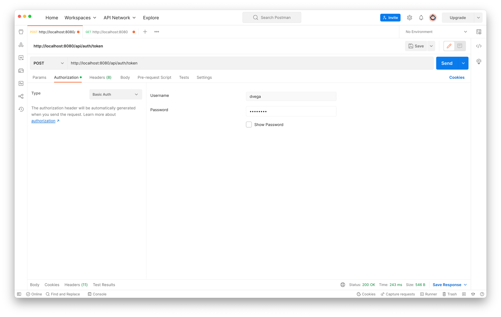

# Spring Security JWT - Implementing Symmetric Key Encryption

W're utilizing Spring Security's built-in OAuth2 Resource Server, which utilizes a cryptographic signature to validate tokens, simplifying the process by eliminating the need to call a separate authorization server. Just to recap what we discussed in the previous tutorial about symmetric and asymmetric keys: 

**Symmetric Key:** The same key is used for signing the token and verifying the signature. 
**Asymmetric Key Pair:** One key to sign the token and a different key is used to verify the signature. 

## Running this application 

To run this application from your IDE run the main method in `Application.java` or from a terminal run the command `./mvnw spring-boot:run`. 

Once the application is up and running the first step is to obtain a JWT. To do this you will need to make a `POST` request to the `/api/auth/token` endpoint with basic auth credentials. The default user defined in `SecurityConfig` has a username of `dvega` and a password of `password`.

From there you will receive a JWT token which you can use to make a `GET` request to `http://localhost:8080` 
